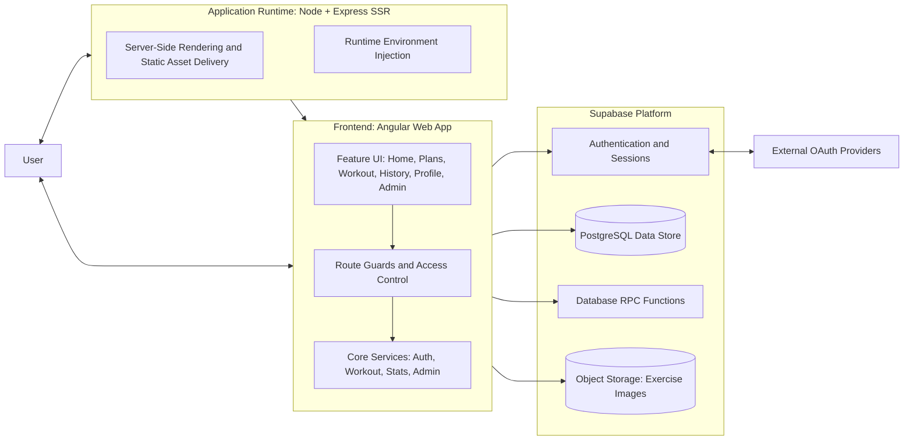

# KANTN Architecture Overview

```mermaid
flowchart LR
  U[User]

  subgraph FE[Frontend: Angular Web App]
    UI[Feature UI: Home, Plans, Workout, History, Profile, Admin]
    AUTHZ[Route Guards and Access Control]
    CORE[Core Services: Auth, Workout, Stats, Admin]
    UI --> AUTHZ
    AUTHZ --> CORE
  end

  subgraph BE[Application Runtime: Node + Express SSR]
    SSR[Server-Side Rendering and Static Asset Delivery]
    ENV[Runtime Environment Injection]
  end

  subgraph DATA[Supabase Platform]
    SBAUTH[Authentication and Sessions]
    DB[(PostgreSQL Data Store)]
    RPC[Database RPC Functions]
    STORAGE[(Object Storage: Exercise Images)]
  end

  OAUTH[External OAuth Providers]

  U <--> FE
  U <--> BE
  BE --> FE
  BE --> ENV
  FE --> SBAUTH
  FE --> DB
  FE --> RPC
  FE --> STORAGE
  SBAUTH <--> OAUTH
```
