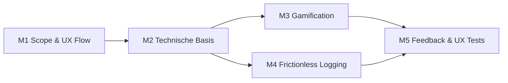

# IXD Feature Requirements

# Roadmap / Meilensteinplan

Projekt Beginn: 15.04

Projekt Deadline: offen

## Milestones

Milestone 1: Scope & UX Flow abgeschlossen
- Finaler Scope für beide Epics ist festgelegt.
- Kern-User-Flows sind als einfache Wireframes oder Screens skizziert.
- Offene Datenschutz- und Sichtbarkeitsregeln für Social Features sind geklärt.

Milestone 2: Technische Basis implementiert
- Datenmodell und Services für Firmen, Leaderboards, Workout-Pläne und Smart Defaults sind vorbereitet.
- Bestehende Workout-Logging-Flows bleiben weiterhin nutzbar.
- Erste UI-Platzhalter für Leaderboard, Social Feedback und geplante Workouts sind eingebaut.

Milestone 3: Epic 1 - Persuasive Design & Gamification umgesetzt
- Firmen-Leaderboards, Team-/Firmenkontext und motivierende Feedback-Elemente sind implementiert.
- Nutzer können ihren Fortschritt im Firmenkontext sehen.
- Datenschutz- und Opt-out-Regeln sind im UI abgebildet.

Milestone 4: Epic 2 - Frictionless Logging & Smart Defaults umgesetzt
- Nutzer können Workouts vorplanen und direkt aus dem Plan starten.
- Beim Logging werden sinnvolle Standardwerte vorgeschlagen.
- Während des Workouts sind nur noch die wichtigsten Eingaben notwendig.

Milestone 5: Feedback & UX Testing abgeschlossen
- 1. Feedbacktermin mit Johannes Robier durchgeführt und Feedback eingearbeitet.
- 2. Feedbacktermin mit Johannes Robier durchgeführt und Feedback eingearbeitet.
- Real-User UX Tests durchgeführt.
- Testfeedback priorisiert und umgesetzt.

# Epics

## Persuasive Design & Gamification (B2B-Ansatz)

Wir implementieren Social-Features und Firmen-Leaderboards. Hierbei steht das „Emotional Design“ im Vordergrund, um durch soziale Dynamiken eine langfristige Verhaltensänderung und Motivation zu fördern.

### Requirements

- Nutzer können einer Firma oder einem Teamkontext zugeordnet werden.
- Nutzer sehen ein Firmen-Leaderboard mit relevanten, verständlichen Metriken.
- Leaderboards sollen motivieren, aber keinen negativen Druck erzeugen.
- Persönliche Trainingsdaten werden nur in aggregierter oder bewusst freigegebener Form angezeigt.
- Nutzer können Social-/Leaderboard-Sichtbarkeit nachvollziehen und bei Bedarf deaktivieren.
- Das Feature soll zunächst einfach bleiben: eine Firmenansicht, ein Leaderboard, ein motivierendes Feedback-Element.

### User Stories

#### Story 1: Company Context

As a company user, I want to be associated with my company or team, so that my progress can contribute to a shared company experience.

**Acceptance Criteria**
- A user can be assigned to one company.
- The app can identify the user's company when showing social features.
- Users without a company can still use the app normally.

**Implementation Tasks**
- [ ] Add or confirm company/team fields in the user profile model.
- [ ] Add repository/service methods to read the current user's company context.
- [ ] Add fallback handling for users without a company.
- [ ] Add basic test coverage for company lookup and missing-company behavior.

#### Story 2: Company Leaderboard

As a company user, I want to see a simple leaderboard, so that I can understand how my company or team is progressing.

**Acceptance Criteria**
- The leaderboard shows ranked users or aggregated team entries for the current company.
- Ranking uses one simple metric for the first version, for example completed workouts or training points.
- The current user's own position is easy to identify.

**Implementation Tasks**
- [ ] Define the first leaderboard metric.
- [ ] Add backend query or repository method for leaderboard data.
- [ ] Build a simple leaderboard UI for the company context.
- [ ] Highlight the current user's row.
- [ ] Add empty, loading, and error states.

#### Story 3: Motivational Feedback

As a company user, I want positive feedback after completing workouts, so that progress feels rewarding and visible.

**Acceptance Criteria**
- After finishing a workout, the app shows a short motivational message.
- The message references personal or company progress when data is available.
- Feedback stays supportive and avoids shaming language.

**Implementation Tasks**
- [ ] Add a small set of motivational message templates.
- [ ] Connect workout completion to the feedback display.
- [ ] Include personal streak or company progress when available.
- [ ] Add UI copy review for tone and clarity.

#### Story 4: Privacy & Visibility Control

As a company user, I want to understand what is visible to others, so that I can trust the social features.

**Acceptance Criteria**
- The app explains what leaderboard data is shown.
- Users can opt out of being shown by name.
- Opted-out users are hidden or anonymized without breaking leaderboard totals.

**Implementation Tasks**
- [ ] Add a profile setting for leaderboard visibility.
- [ ] Respect the visibility setting in leaderboard queries.
- [ ] Add short explanatory copy near the leaderboard or setting.
- [ ] Test anonymized and hidden-user leaderboard behavior.

## Frictionless Logging & Smart Defaults

Ein zentrales Problem bestehender Apps ist die hohe Interaktionshürde bei der Dateneingabe. Wir konzipieren einen Workflow für „reibungslose“ Protokollierung, der durch Vorplanung im Kalender und intelligente Standardwerte (Smart Defaults) die manuelle Eingabe während des Workouts auf ein Minimum reduziert.

### Requirements

- Nutzer können geplante Workouts aus einem Kalender oder einer Planansicht starten.
- Beim Start eines geplanten Workouts werden Übungen, Reihenfolge und Zielwerte vorausgefüllt.
- Während des Workouts müssen Nutzer nur Abweichungen oder Abschlusswerte anpassen.
- Smart Defaults basieren zunächst auf dem Plan und zuletzt gespeicherten Werten.
- Nutzer können Default-Werte jederzeit überschreiben.
- Der bestehende manuelle Logging-Flow bleibt verfügbar.

### User Stories

#### Story 1: Planned Workout Start

As a user, I want to start a workout from my plan or calendar, so that I do not need to rebuild the workout manually.

**Acceptance Criteria**
- Planned workouts are visible in a simple upcoming-workouts view.
- A planned workout can be started directly.
- Starting a planned workout opens the existing workout flow with prefilled exercises.

**Implementation Tasks**
- [ ] Add or reuse a planned-workouts data source.
- [ ] Build a simple upcoming-workouts list or calendar entry point.
- [ ] Add a "start workout" action for planned workouts.
- [ ] Map planned workout exercises into the active workout state.
- [ ] Add tests for starting a workout from a plan.

#### Story 2: Smart Exercise Defaults

As a user, I want exercise values to be prefilled, so that I only need to edit what changed today.

**Acceptance Criteria**
- Planned target values are used first when available.
- If no plan value exists, the app can suggest values from the user's latest matching workout.
- Users can edit all suggested values before saving.

**Implementation Tasks**
- [ ] Define priority order for defaults: plan value, last workout value, empty value.
- [ ] Add service logic for resolving default sets, reps, weight, duration, or distance.
- [ ] Show suggested values in the workout UI.
- [ ] Make edited values override suggestions for the current session.
- [ ] Add unit tests for default priority rules.

#### Story 3: Low-Friction Workout Logging

As a user, I want to complete workout entries with minimal taps, so that logging does not interrupt my training.

**Acceptance Criteria**
- Users can confirm a prefilled set quickly.
- Users can adjust only the fields that changed.
- The UI clearly distinguishes suggested values from confirmed values.

**Implementation Tasks**
- [ ] Add a quick-confirm action for prefilled workout entries.
- [ ] Keep manual editing available for every logged value.
- [ ] Add visual state for suggested, edited, and confirmed values.
- [ ] Ensure keyboard and mobile interactions stay efficient.
- [ ] Run a short manual UX pass on the logging flow.

#### Story 4: Calendar-Aware Reminders

As a user, I want the app to remind me about planned workouts, so that I can start logging at the right time.

**Acceptance Criteria**
- The app shows today's planned workout prominently.
- Missed or upcoming workouts are clearly labeled.
- Reminder behavior works without requiring external calendar integration in the first version.

**Implementation Tasks**
- [ ] Add date status logic for today, upcoming, and missed workouts.
- [ ] Surface today's workout on the main workout or dashboard screen.
- [ ] Add simple labels for planned workout status.
- [ ] Add tests for date status logic.
